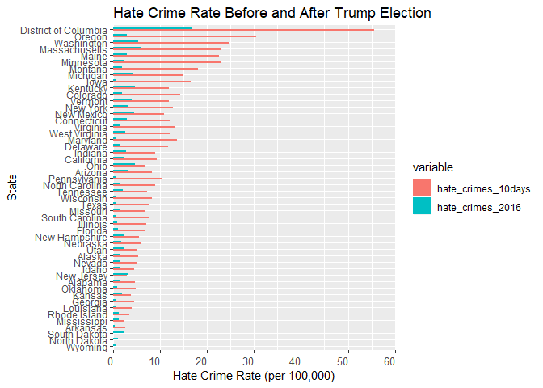
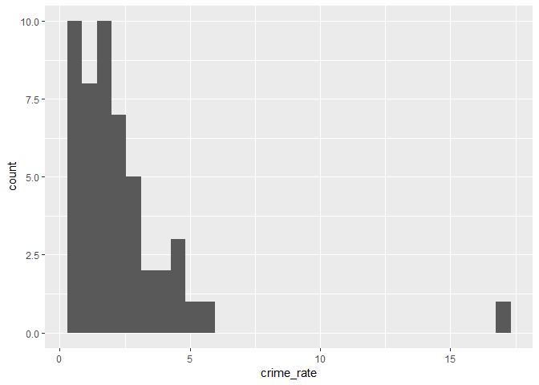
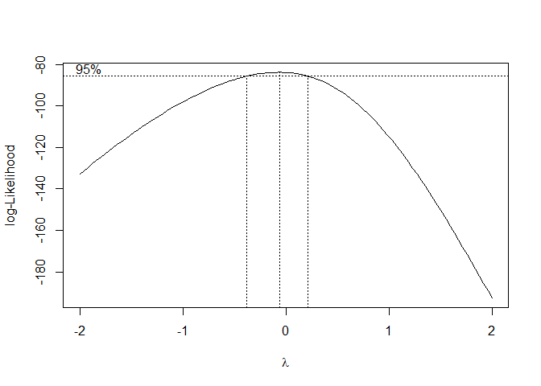

Hate Crime Over the Past Decade
================
December 6, 2018

\`\`\`

| Name           | Uni    |
|----------------|--------|
| Kee-Young Shin | ks3663 |
| Runqi Ma       | rm3609 |
| Zixu Wang      | zw2541 |
| Man Luo        | lm4239 |
| Jingyu Xu      | jx2371 |

Motivation
----------

In the past recent years, the United States has been facing clashes of opinions and ideals, dividing the citizens within the country. We believe the increase in discriminative sentiments and conflicts between groups(races, ethnicities, sexual orientation, etc.) could be due to the election of Donald Trump as President, and the resulting shift in political power.

We sought to determine just how much these divisions within subgroups have increased through an analysis of hate crimes committed in the country. Hate crimes- crimes motivated by ethnic, racial, sexual, or other prejudices- would be a good indicator since they are directly related to these clashing ideals and divisions. Our goal is to see how hate crimes have changed over the years and determine its relationship to various predictors including political support.

Related Work
------------

We were inspired to conduct this analysis after reading an article by USA Today that stated that hate crimes in 2017 increased in America's ten largest cities. The article can be found here: <https://www.usatoday.com/story/news/2018/07/17/hate-crimes-up-america-10-largest-cities/776721002/>

Initial Questions
-----------------

There were several questions that we wanted to find out. Did hate crimes increase over the past decade? Was this change in part due to the change in the U.S. presidency? How do hate crimes differ by state?

As we progressed through the project, some new questions arised. To see if the election affected hate crime rates, we wanted to find the relationship between the amount of Trump voters to the level of hate crime. Additionally, we wanted to find out if certain variables could be used to predict hate crime rate.

Data
----

``` r
# read in crime data 
hate_offenses_2017 = read_xls("./data/table-1.xls") %>% 
  janitor::clean_names() %>% 
  filter(table_1 == "Total") %>% 
  mutate(table_1 = str_replace(table_1, "Total", "2017"))

hate_offenses_2016 = read_xls("./data/2016_hatecrime.xls") %>% 
  janitor::clean_names() %>% 
  filter(table_1 == "Total") %>% 
  mutate(table_1 = str_replace(table_1, "Total", "2016")) %>% 
  select(1:5)

hate_offenses_2015 = read_xls("./data/2015_hatecrime.xls") %>% 
  janitor::clean_names() %>% 
  filter(table_1 == "Total") %>% 
  mutate(table_1 = str_replace(table_1, "Total", "2015"))
    
hate_offenses_2014 = read_xls("./data/2014_hatecrime.xls") %>% 
  janitor::clean_names() %>% 
  filter(table_1 == "Total") %>% 
  mutate(table_1 = str_replace(table_1, "Total", "2014")) %>% 
  select(1:5)

hate_offenses_2013 = read_xls("./data/2013_hatecrime.xls") %>% 
  janitor::clean_names() %>% 
  filter(table_1 == "Total") %>% 
  mutate(table_1 = str_replace(table_1, "Total", "2013")) %>% 
  select(1:5)

hate_offenses_2012 = read_xls("./data/2011_hatecrime.xls") %>% 
  janitor::clean_names() %>% 
  filter(table_1 == "Total") %>% 
  mutate(table_1 = str_replace(table_1, "Total", "2012"))

hate_offenses_2011 = read_xls("./data/2011_hatecrime.xls") %>% 
  janitor::clean_names() %>% 
  filter(table_1 == "Total") %>% 
  mutate(table_1 = str_replace(table_1, "Total", "2011"))

hate_offenses_2010 = read_xls("./data/2010_hatecrime.xls") %>% 
  janitor::clean_names() %>% 
  filter(table_1 == "Total") %>% 
  mutate(table_1 = str_replace(table_1, "Total", "2010"))

hate_offenses_2009 = read_xls("./data/2009_hatecrime.xls") %>% 
  janitor::clean_names() %>% 
  filter(table_1 == "Total") %>% 
  mutate(table_1 = str_replace(table_1, "Total", "2009"))

hate_offenses_2008 = read_xls("./data/2008_hatecrime.xls") %>% 
  janitor::clean_names() %>% 
  filter(table_1 == "Total") %>% 
  mutate(table_1 = str_replace(table_1, "Total", "2008"))

hate_offenses_2007 = read_xls("./data/2007_hatecrime.xls") %>% 
  janitor::clean_names() %>% 
  filter(table_1 == "Total") %>% 
  mutate(table_1 = str_replace(table_1, "Total", "2007"))

hate_offenses_2006 = read_xls("./data/2006_hatecrime.xls") %>% 
  janitor::clean_names() %>% 
  filter(table_1 == "Total") %>% 
  mutate(table_1 = str_replace(table_1, "Total", "2006"))

hate_offenses_2005 = read_xls("./data/2005_hatecrime.xls") %>% 
  janitor::clean_names() %>% 
  filter(table_1 == "Total") %>% 
  mutate(table_1 = str_replace(table_1, "Total", "2005"))

# aggregate data for all years
hatecrime_count_df = rbind(hate_offenses_2017, hate_offenses_2016, hate_offenses_2015, 
                           hate_offenses_2014, hate_offenses_2013, hate_offenses_2012,
                           hate_offenses_2011, hate_offenses_2010, hate_offenses_2009,
                           hate_offenses_2008, hate_offenses_2007, hate_offenses_2006,
                           hate_offenses_2005) %>% 
  select(1:3) 
  
colnames(hatecrime_count_df) = c("year", "total_incidents", "total_offenses")
```

We first created a dataset containing the number of hate crime incidents and offenses from 2005 to 2017 by compiling the yearly hate crime data from the FBI data source (the links to the datasets are provided below). We excluded the number of victims and known offenders also offered by these datasets, since they were not releveant to our analysis. The variable names were changed using colnames since the raw data did not have these variable names.

``` r
library(tidyverse)
library(readxl)
#list
df = list.files(path = "./annual")
#function
read_data = function(x){read_excel(str_c("./annual/", x),  range = "A3:E54") %>%
    mutate(year = x)}
#map
hate_crime = map(df, read_data) %>%
  bind_rows() %>%
  janitor::clean_names() %>%
  select(-agencies_submitting_incident_reports, -agencies_submitting_incident_reports_2,-agencies_submitting_incident_reports_3) %>%
  mutate(year = str_replace(year, ".xls", "")) %>%
  select(year, everything())
#set na to 0
hate_crime[is.na(hate_crime)] = 0

#complete the final dataset
hate_crime = hate_crime %>%
  mutate(total_incident = total_number_of_incidents_reported + total_number_of_incidents_reported_2) %>%
  select(year, state = participating_state, population = population_covered, total_incident) %>%
  filter(state != "Total") %>%
  mutate(annualprop = total_incident/population*100000) %>%
  mutate(year = str_replace(year, ".xls", "")) %>%
  filter(state !="Guam1") %>%
  filter(state !="")
```

<<<<<<< HEAD
Then we created a dataset containing the annual hate crime rate for each state from 2005 to 2017. This was done by compiling data from the FBI data source and extracting the total number of hate crime incidents and the total population for each state. These values were then used to calculate the hate crime rate (per 100,000 people) by dividing the total incident count by the total population and then multiplying by 100,000. The cleaning portion for this dataset involved converting the list files to tidy data frames and rename columns in reasonable way. In the process of tidying the raw data, some columns were split into two columns resulting in NA's for some values. We resolved this issue by converting the NA's to 0 and then combining the split columns back into one column（taking the sum）. For 2011, 2012, 2014 datasets, we excluded data for Virgin Islands and Guam in order to conduct analyses solely on states.

Next, to create a model for predicting the level of hate crime, we created a dataset composed of possible predictors. The dataset was created by compiling raw data from various sources that included the following predictors for the year 2016: median income, proportion of people with a high school degree, unemployment rate, proportion of non-citizens, proportion of white citizens, proportion of Trump voters. For the hate crime rate dataset, the rate was calculated again by taking the total hate crime incidents for 2016 and dividing by the total population and multiplying by 100,000. Each compiled raw dataset were cleaned for names and the location and the corresponding statistic of interest were extracted. These datasets were then merged to create compiled dataset consisting of states, their respective hate crime rates, and various predictors. Hawaii and its corresponding values were dropped since it contained many missing data. Lastly, this dataset was finalized by cleaning its variables. We remove the $ symbol from income values, and converting the median household income variable to numeric. In addition, we remove the % symbol from share Trump voters variable and convert them to numeric.

``` r
# predictor data in 2016
income = read_csv("./data/Income.csv") %>% 
  janitor::clean_names()
```

    ## Parsed with column specification:
    ## cols(
    ##   Location = col_character(),
    ##   `Median Annual Household Income` = col_character()
    ## )

``` r
unemployment = read_csv("./data/Unemployment.csv") %>% 
  janitor::clean_names()
```

    ## Parsed with column specification:
    ## cols(
    ##   Location = col_character(),
    ##   Unemployed = col_double()
    ## )

``` r
education = read_csv("./data/Educational_level.csv") %>% 
  janitor::clean_names()
```

    ## Parsed with column specification:
    ## cols(
    ##   Location = col_character(),
    ##   share_population_with_high_school_degree = col_double()
    ## )

``` r
ctizenship = read_csv("./data/Ctizenship.csv") %>% 
  janitor::clean_names()
```

    ## Parsed with column specification:
    ## cols(
    ##   Location = col_character(),
    ##   Citizen = col_double(),
    ##   `Non-Citizen` = col_double(),
    ##   Total = col_integer()
    ## )

``` r
race = read_csv("./data/Race.csv") %>% 
  janitor::clean_names()
```

    ## Parsed with column specification:
    ## cols(
    ##   Location = col_character(),
    ##   White = col_double(),
    ##   Black = col_character(),
    ##   Hispanic = col_double(),
    ##   Asian = col_character(),
    ##   `American Indian/Alaska Native` = col_character(),
    ##   `Native Hawaiian/Other Pacific Islander` = col_character(),
    ##   `Two Or More Races` = col_character(),
    ##   Total = col_integer(),
    ##   Footnotes = col_integer()
    ## )

``` r
vote = read_csv("./data/Vote.csv") %>% 
  janitor::clean_names()
```

    ## Parsed with column specification:
    ## cols(
    ##   Location = col_character(),
    ##   share_voters_voted_trump = col_character()
    ## )

``` r
crime_rate = read_excel("./data/2016.xls",  range = cell_rows(3:54)) %>%
  janitor::clean_names() %>%
  filter(participating_state != "Total") %>%
  select(location = participating_state, population_covered,       total_number_of_incidents_reported) %>%
  mutate(crime_rate = total_number_of_incidents_reported/population_covered*100000)

crime_rate_10_days = read_csv("./data/hate_crime_10days.csv") %>%
  janitor::clean_names()%>%
  select(location = state, hate_crime_10_day = hate_crimes_per_100k_splc)
```

    ## Parsed with column specification:
    ## cols(
    ##   state = col_character(),
    ##   hate_crimes_per_100k_splc = col_double()
    ## )

``` r
ctizenship =
  ctizenship %>% 
  select(location, non_citizen)

race =
  race %>% 
  select(location, white)

crime_rate =
  crime_rate %>% 
  select(location, crime_rate)

merge_data = 
  merge(income, unemployment, by = "location") %>% 
  merge(., education, by = "location") %>% 
  merge(., ctizenship, by = "location") %>% 
  merge(., race, by = "location") %>% 
  merge(., vote, by = "location") %>%
  merge(., crime_rate, by = "location") %>%
  merge(., crime_rate_10_days, by = "location") %>%
  filter(location != "United States") %>% 
  rename(state = location, share_unemployed = unemployed, share_non_citizen = non_citizen, share_white = white)%>%
  mutate(median_annual_household_income = str_replace(median_annual_household_income, ",", "")) %>%
  mutate(median_annual_household_income = gsub("\\$", "",median_annual_household_income )) %>%
mutate(median_annual_household_income = as.numeric(median_annual_household_income)) %>%
  select(state, median_income = median_annual_household_income, everything())%>%
  mutate(share_voters_voted_trump = sub("\\%", "",share_voters_voted_trump))%>%
  mutate(share_voters_voted_trump = as.numeric(share_voters_voted_trump)/100)
```
=======
&lt;&lt;&lt;&lt;&lt;&lt;&lt; HEAD
>>>>>>> 431232e9f2718884ba12225c5ab5cc772328ca52

> > > > > > > 3e09ecca87ec9734aef57b01c1ddcb5444f23e4d

To create the line chart showing the number of different kinds of hate crime incidents during 2005 to 2017, we combined the annual data from FBI. The merged dataset contains year, the incidents of hate crime, three type of hate crime motivation we want to see:"race", "religion" and "sexual orientation" and the specific bias motivation. FBI changed the way they categoried three types of hate crime at 2013 and 2015, we make some change to the categorical name to make the plot more presentable over years. We change the type name from "Anti-Black or African American" to "Anti-Black", "Anti-American Indian or Alaska Native" to "Anti-American Indian/Alaskan Native", "Anti-Islamic (Muslim)" to "Anti-Islamic", "Anti-Gay (Male)" to "Anti-Male Homosexual", "Anti-Lesbian" to "Anti-Female Homosexual" and "Anti-Lesbian, Gay, Bisexual, or Transgender (Mixed Group)" to "Anti-Homosexual" in order to make them identical with previous years. From 2005 to 2014, the "Anti-Hispanic or Latino" hate crime is categorized as "Ethnicity", we change it as "race". Also since 2013, FBI seperate "Anti-Asian" and "Anti-Native Hawaiian or Other Pacific Islander", we combine there two type as one.

*FBI data resource，state division：*

*2005*：<https://ucr.fbi.gov/hate-crime/2005>

*2006*: <https://ucr.fbi.gov/hate-crime/2006>

*2007*: <https://ucr.fbi.gov/hate-crime/2007>

*2008*：<https://ucr.fbi.gov/hate-crime/2008>

*2009*: <https://ucr.fbi.gov/hate-crime/2009>

*2010*: <https://ucr.fbi.gov/hate-crime/2010>

*2011*: <https://ucr.fbi.gov/hate-crime/2011>

*2012*: <https://ucr.fbi.gov/hate-crime/2012>

*2013*: <https://ucr.fbi.gov/hate-crime/2013>

*2014*: <https://ucr.fbi.gov/hate-crime/2014>

*2015*: <https://ucr.fbi.gov/hate-crime/2015>

*2016*: <https://ucr.fbi.gov/hate-crime/2016>

*2017*: <https://ucr.fbi.gov/hate-crime/2017>

*Median annual household income:* <https://www.kff.org/other/state-indicator/median-annual-income/?currentTimeframe=0&sortModel=%7B%22colId%22:%22Location%22,%22sort%22:%22asc%22%7D>

*Share of the population that is unemployed:* <https://www.kff.org/other/state-indicator/unemployment-rate/?currentTimeframe=2&sortModel=%7B%22colId%22:%22Location%22,%22sort%22:%22asc%22%7D>

*Share of the population with high school degree:* <https://www.census.gov/prod/2012pubs/p20-566.pdf>

*Share of the population that are not U.S. citizens:* <https://www.kff.org/other/state-indicator/distribution-by-citizenship-status/?currentTimeframe=1&sortModel=%7B%22colId%22:%22Location%22,%22sort%22:%22asc%22%7D>

*Share of the population that is white:* <https://www.kff.org/other/state-indicator/distribution-by-raceethnicity/?currentTimeframe=0&sortModel=%7B%22colId%22:%22Location%22,%22sort%22:%22asc%22%7D>

*Share of 2016 U.S. presidential voters who voted for Donald Trump:* <https://projects.fivethirtyeight.com/2016-swing-the-election/>

*The hate crime rate from 11.09.2016 to 11.18.2016:* <https://www.splcenter.org/20161129/ten-days-after-harassment-and-intimidation-aftermath-election>

Exploratory Analysis
--------------------

``` r
# plot change in number of hate crimes over time
hatecrime_count_df %>% 
  plot_ly(x = ~year, y = ~total_incidents, type = "scatter", mode = "line") %>% 
  layout(title = "Change In Total Hate Crime Incidents From 2005 to 2017")
```

We first created a simple plot to see how hate crimes in the U.S. changed from 2005 to 2017. This was done by aggregating the yearly hate crime reports and creating a line chart depicting the total number of hate crime incidences over the specified timeline. We used the incidence counts rather than offenses for simplicity, since there could be multiple offenses commited per incident.

``` r
library(reshape2)

hate_crime_10days = read_csv("./data/hate_crime_10days.csv")
```

    ## Parsed with column specification:
    ## cols(
    ##   state = col_character(),
    ##   hate_crimes_per_100k_splc = col_double()
    ## )

``` r
hate_crime_ave = hate_crime %>% 
  na.omit() %>% 
  filter(year == 2016) 


compare_rate<-merge(hate_crime_10days, hate_crime_ave, by = "state")

compare_rate %>% 
  mutate(hate_crimes_10days = hate_crimes_per_100k_splc/10 * 365,
         hate_crimes_2016 = annualprop) %>% 
  select(state, hate_crimes_10days, hate_crimes_2016) %>% 
  melt(, id = "state") %>% 
  mutate(state = factor(state, levels = state %>% unique %>% sort(decreasing = T))) %>% 
  mutate(state = reorder(state, value)) %>% 
  ggplot(aes(x = state, y = value, fill = variable, group = variable)) +
  geom_bar(stat="identity", position = "dodge", width = 0.5) +
  scale_y_continuous(expand = c(0, 0), limits = c(0, 60)) +
  coord_flip() +
  theme(axis.text.x = element_text(angle = 0, size = 10, hjust = 1),legend.position = "right") +
  ggtitle("Hate Crime Rate Before and After Trump Election") +
  labs(y = "Hate Crime Rate (per 100,000)", x = "State")
```



Next we tried to see if there was a change in the hate crime rate after Trump was elected. We did this by creating a stacked bar plot comparing the hate crime rate for 2016 to the hate crime rate in the 10 days after the election. To accurately compare these figures, we extrapolated the yearly equivalent for the hate crime rate for the 10 days after the election. This was done by calculating the average daily hate crime rate in the 10 day period and multiplying by 365.

``` r
map_data_2016 = merge_data %>%
  rbind(c("Hawaii",71223,   0.034, 0.904,   0 ,0.81, '33.1%', 0 ,0)) %>% 
  as.tibble() %>% 
  arrange(state)

map_data = map_data_2016 %>%         
  mutate(
         state = as.factor(state),
         code = state.abb[state],
         code = c(code[1:8],'DC',code[9:50]),
         hover = with(map_data_2016, paste(state,'<br>' ,"share for trump",share_voters_voted_trump)),
         crime_rate = as.numeric(crime_rate)
         ) %>% 
  select(code, crime_rate, hover)

l <- list(color = toRGB("grey"), width = 1)
g <- list(
  scope = 'usa',
  projection = list(type = 'albers usa'),
  showlakes = F
)


plot_geo(map_data, locationmode = 'USA-states') %>%
  add_trace(
    z = ~ crime_rate, text = ~hover, locations = ~code,
    color = ~ crime_rate, colors = 'Reds',marker = list(line = l)
  ) %>%
  colorbar(title = "Hate crime rate ") %>%
  layout(
    title = 'Hate crime rate in 2016 all over U.S. ',
    geo = g
  )
```

Initially, we wanted to show how the hate crime rate changed as the percent of trump voters increased. However, since, many states shared similar proportions of Trump voters, the plot was not able to accurately show this change. Instead, we decided to create an interactive map of the U.S. that showed the hate crime rate for each state and its share of Trump voters for 2016 (This is an interactive plot which can not be showne in md file, please refer to webstie). When creating the map, R was not recognizing "District of Columbia" as a state since it was not abbreviated like the other states. Therefore we manipulated the code to make R recognize this value.

Inspired by these heat maps, we decided to create a shiny app containing heat maps depicting the hate crime rate for the years 2005 to 2017. These maps allowed for analysis of the variation in the crime rate amongst the states.

``` r
tidy_data = function(data, x){
  data %>% 
  janitor::clean_names() %>% 
  select(table_1, x_1) %>% 
  filter(str_detect(table_1, "Anti")) %>% 
  mutate(type = "i",
         year = x) 
}

hc_2017 = read_xls("./data/table-1.xls")
hc_2016 = read_xls("./data/2016_hatecrime.xls")
hc_2015 = read_xls("./data/2015_hatecrime.xls")
hc_2014 = read_xls("./data/2014_hatecrime.xls")
hc_2013 = read_xls("./data/2013_hatecrime.xls")
hc_2012 = read_xls("./data/2012_hatecrime.xls")
hc_2011 = read_xls("./data/2011_hatecrime.xls")
hc_2010 = read_xls("./data/2010_hatecrime.xls")
hc_2009 = read_xls("./data/2009_hatecrime.xls")
hc_2008 = read_xls("./data/2008_hatecrime.xls")
hc_2007 = read_xls("./data/2007_hatecrime.xls")
hc_2006 = read_xls("./data/2006_hatecrime.xls")
hc_2005 = read_xls("./data/2005_hatecrime.xls")

change_name = function(data){
  data %>% 
  filter(type != "i") %>% 
  mutate(table_1 = str_replace(table_1, "Anti-American Indian or Alaska Native","Anti-American Indian/Alaskan Native"),
         table_1 = str_replace(table_1, " or African American", ""),
         table_1 = str_replace(table_1, " or Latino", ""),
         table_1 = str_replace(table_1, " \\(Muslim\\)", ""),
         table_1 = str_replace(table_1, "Lesbian", "Female Homosexual"),
         table_1 = str_replace(table_1, "Gay \\(Male\\)", "Male Homosexual"),
         table_1 = str_replace(table_1, "Female Homosexual, Gay\\, Bisexual\\, or Transgender \\(Mixed Group\\)", "Homosexual"))
  
}
```

``` r
hc_2017 = tidy_data(hc_2017, 2017)

hc_2017$type[1:9] = "race"
hc_2017$type[10:23] = "religion"
hc_2017$type[24:28] = "sexual orientation"

hc_2017 = 
  change_name(hc_2017) %>%   
  filter(table_1 != "Anti-Asian") %>% 
  mutate(table_1 = str_replace(table_1,"Anti-Native Hawaiian or Other Pacific Islander", "Anti-Asian/Pacific Islander"))

hc_2017$x_1[4] = 147
```

``` r
hc_2016 = tidy_data(hc_2016, 2016)

hc_2016$type[1:9] = "race"
hc_2016$type[10:23] = "religion"
hc_2016$type[24:28] = "sexual orientation"

hc_2016 = 
  change_name(hc_2016) %>% 
  filter(table_1 != "Anti-Asian") %>%
  mutate(table_1 = str_replace(table_1,"Anti-Native Hawaiian or Other Pacific Islander", "Anti-Asian/Pacific Islander"))

hc_2016$x_1[4] = 122
```

``` r
hc_2015 = tidy_data(hc_2015, 2015)

hc_2015$type[1:9] = "race"
hc_2015$type[10:23] = "religion"
hc_2015$type[24:28] = "sexual orientation"

hc_2015 = 
  change_name(hc_2015) %>% 
  filter(table_1 != "Anti-Asian") %>%
  mutate(table_1 = str_replace(table_1,"Anti-Native Hawaiian or Other Pacific Islander", "Anti-Asian/Pacific Islander"))

hc_2015$x_1[4] = 115
```

``` r
hc_2014 = tidy_data(hc_2014, 2014)

hc_2014$type[1:6] = "race"
hc_2014$type[7:13] = "religion"
hc_2014$type[14:18] = "sexual orientation"

hc_2014 = 
  change_name(hc_2014) %>% 
  filter(table_1 != "Anti-Asian") %>%
  mutate(table_1 = str_replace(table_1,"Anti-Native Hawaiian or Other Pacific Islander", "Anti-Asian/Pacific Islander"))

hc_2014$x_1[4] = 143
```

``` r
hc_2013 = tidy_data(hc_2013, 2013)

hc_2013$type[1:6] = "race"
hc_2013$type[19] = "race"
hc_2013$type[7:13] = "religion"
hc_2013$type[14:18] = "sexual orientation"

hc_2013 = 
  change_name(hc_2013) %>% 
  filter(table_1 != "Anti-Asian") %>%
  mutate(table_1 = str_replace(table_1,"Anti-Native Hawaiian or Other Pacific Islander", "Anti-Asian/Pacific Islander"))

hc_2013$x_1[4] = 138
```

``` r
hc_2012 = tidy_data(hc_2012, 2012) 

hc_2012$type[1:5] = "race"
hc_2012$type[18] = "race"
hc_2012$type[6:12] = "religion"
hc_2012$type[13:17] = "sexual orientation"

hc_2012 = hc_2012 %>% filter(type != "i")
```

``` r
hc_2011 = tidy_data(hc_2011, 2011)

hc_2011$type[1:5] = "race"
hc_2011$type[18] = "race"
hc_2011$type[6:12] = "religion"
hc_2011$type[13:17] = "sexual orientation"

hc_2011 = hc_2011 %>% filter(type != "i")
```

``` r
hc_2010 = tidy_data(hc_2010, 2010) 

hc_2010$type[1:5] = "race"
hc_2010$type[18] = "race"
hc_2010$type[6:12] = "religion"
hc_2010$type[13:17] = "sexual orientation"

hc_2010 = hc_2010 %>% filter(type != "i")
```

``` r
hc_2009 = tidy_data(hc_2009, 2009) 

hc_2009$type[1:5] = "race"
hc_2009$type[18] = "race"
hc_2009$type[6:12] = "religion"
hc_2009$type[13:17] = "sexual orientation"

hc_2009 = hc_2009 %>% filter(type != "i")
```

``` r
hc_2008 = tidy_data(hc_2008, 2008) 

hc_2008$type[1:5] = "race"
hc_2008$type[18] = "race"
hc_2008$type[6:12] = "religion"
hc_2008$type[13:17] = "sexual orientation"

hc_2008 = hc_2008 %>% filter(type != "i")
```

``` r
hc_2007 = tidy_data(hc_2007, 2007) 

hc_2007$type[1:5] = "race"
hc_2007$type[18] = "race"
hc_2007$type[6:12] = "religion"
hc_2007$type[13:17] = "sexual orientation"

hc_2007 = hc_2007 %>% filter(type != "i")
```

``` r
hc_2006 = tidy_data(hc_2006, 2006) 

hc_2006$type[1:5] = "race"
hc_2006$type[18] = "race"
hc_2006$type[6:12] = "religion"
hc_2006$type[13:17] = "sexual orientation"

hc_2006 = hc_2006 %>% filter(type != "i")
```

``` r
hc_2005 = tidy_data(hc_2005, 2005) 

hc_2005$type[1:5] = "race"
hc_2005$type[18] = "race"
hc_2005$type[6:12] = "religion"
hc_2005$type[13:17] = "sexual orientation"

hc_2005 = hc_2005 %>% filter(type != "i")
```

``` r
all_data = rbind(hc_2017, hc_2016, hc_2015, hc_2014, hc_2013, hc_2012, hc_2011, hc_2010, hc_2009, hc_2008, hc_2007, hc_2006, hc_2005) %>% 
  as.tibble() %>% 
  mutate(x_1 = as.numeric(x_1))
```

<<<<<<< HEAD
``` r
types = all_data %>% distinct(type) %>% pull()
=======
======= Next, to create a model for predicting the level of hate crime, we created a dataset composed of possible predictors. The dataset was created by compiling raw data from various sources that included the following predictors for the year 2016: median income, proportion of people with a high school degree, unemployment rate, proportion of non-citizens, proportion of white citizens, proportion of Trump voters. For the hate crime rate dataset, the rate was calculated again by taking the total hate crime incidents for 2016 and dividing by the total population and multiplying by 100,000. Each compiled raw dataset were cleaned for names and the location and the corresponding statistic of interest were extracted. These datasets were then merged to create compiled dataset consisting of states, their respective hate crime rates, and various predictors. Hawaii and its corresponding values were dropped since it contained many missing data. Lastly, this dataset was finalized by cleaning its variables. We remove the $ symbol from income values, and converting the median household income variable to numeric. In addition, we remove the % symbol from share Trump voters variable and convert them to numeric.

``` r
# predictor data in 2016
income = read_csv("./data/Income.csv") %>% 
  janitor::clean_names()
```

    ## Parsed with column specification:
    ## cols(
    ##   Location = col_character(),
    ##   `Median Annual Household Income` = col_character()
    ## )

``` r
unemployment = read_csv("./data/Unemployment.csv") %>% 
  janitor::clean_names()
```

    ## Parsed with column specification:
    ## cols(
    ##   Location = col_character(),
    ##   Unemployed = col_double()
    ## )

``` r
education = read_csv("./data/Educational_level.csv") %>% 
  janitor::clean_names()
```

    ## Parsed with column specification:
    ## cols(
    ##   Location = col_character(),
    ##   share_population_with_high_school_degree = col_double()
    ## )

``` r
ctizenship = read_csv("./data/Ctizenship.csv") %>% 
  janitor::clean_names()
```

    ## Parsed with column specification:
    ## cols(
    ##   Location = col_character(),
    ##   Citizen = col_double(),
    ##   `Non-Citizen` = col_double(),
    ##   Total = col_integer()
    ## )

``` r
race = read_csv("./data/Race.csv") %>% 
  janitor::clean_names()
```

    ## Parsed with column specification:
    ## cols(
    ##   Location = col_character(),
    ##   White = col_double(),
    ##   Black = col_character(),
    ##   Hispanic = col_double(),
    ##   Asian = col_character(),
    ##   `American Indian/Alaska Native` = col_character(),
    ##   `Native Hawaiian/Other Pacific Islander` = col_character(),
    ##   `Two Or More Races` = col_character(),
    ##   Total = col_integer(),
    ##   Footnotes = col_integer()
    ## )

``` r
vote = read_csv("./data/Vote.csv") %>% 
  janitor::clean_names()
```

    ## Parsed with column specification:
    ## cols(
    ##   Location = col_character(),
    ##   share_voters_voted_trump = col_character()
    ## )

``` r
crime_rate = read_excel("./data/2016.xls",  range = cell_rows(3:54)) %>%
  janitor::clean_names() %>%
  filter(participating_state != "Total") %>%
  select(location = participating_state, population_covered,       total_number_of_incidents_reported) %>%
  mutate(crime_rate = total_number_of_incidents_reported/population_covered*100000)

crime_rate_10_days = read_csv("./data/hate_crime_10days.csv") %>%
  janitor::clean_names()%>%
  select(location = state, hate_crime_10_day = hate_crimes_per_100k_splc)
```

    ## Parsed with column specification:
    ## cols(
    ##   state = col_character(),
    ##   hate_crimes_per_100k_splc = col_double()
    ## )

``` r
ctizenship =
  ctizenship %>% 
  select(location, non_citizen)

race =
  race %>% 
  select(location, white)

crime_rate =
  crime_rate %>% 
  select(location, crime_rate)

merge_data = 
  merge(income, unemployment, by = "location") %>% 
  merge(., education, by = "location") %>% 
  merge(., ctizenship, by = "location") %>% 
  merge(., race, by = "location") %>% 
  merge(., vote, by = "location") %>%
  merge(., crime_rate, by = "location") %>%
  merge(., crime_rate_10_days, by = "location") %>%
  filter(location != "United States") %>% 
  rename(state = location, share_unemployed = unemployed, share_non_citizen = non_citizen, share_white = white)%>%
  mutate(median_annual_household_income = str_replace(median_annual_household_income, ",", "")) %>%
  mutate(median_annual_household_income = gsub("\\$", "",median_annual_household_income )) %>%
mutate(median_annual_household_income = as.numeric(median_annual_household_income)) %>%
  select(state, median_income = median_annual_household_income, everything())%>%
  mutate(share_voters_voted_trump = sub("\\%", "",share_voters_voted_trump))%>%
  mutate(share_voters_voted_trump = as.numeric(share_voters_voted_trump)/100)
```

> > > > > > > 3e09ecca87ec9734aef57b01c1ddcb5444f23e4d To create the line chart showing the number of different kinds of hate crime incidents during 2005 to 2017, we combined the annual data from FBI. The merged dataset contains year, the incidents of hate crime, three type of hate crime motivation we want to see:"race", "religion" and "sexual orientation" and the specific bias motivation. FBI changed the way they categoried three types of hate crime at 2013 and 2015, we make some change to the categorical name to make the plot more presentable over years. We change the type name from "Anti-Black or African American" to "Anti-Black", "Anti-American Indian or Alaska Native" to "Anti-American Indian/Alaskan Native", "Anti-Islamic (Muslim)" to "Anti-Islamic", "Anti-Gay (Male)" to "Anti-Male Homosexual", "Anti-Lesbian" to "Anti-Female Homosexual" and "Anti-Lesbian, Gay, Bisexual, or Transgender (Mixed Group)" to "Anti-Homosexual" in order to make them identical with previous years. From 2005 to 2014, the "Anti-Hispanic or Latino" hate crime is categorized as "Ethnicity", we change it as "race". Also since 2013, FBI seperate "Anti-Asian" and "Anti-Native Hawaiian or Other Pacific Islander", we combine there two type as one.

*FBI data resource，state division：*

*2005*：<https://ucr.fbi.gov/hate-crime/2005>

*2006*: <https://ucr.fbi.gov/hate-crime/2006>

*2007*: <https://ucr.fbi.gov/hate-crime/2007>

*2008*：<https://ucr.fbi.gov/hate-crime/2008>

*2009*: <https://ucr.fbi.gov/hate-crime/2009>

*2010*: <https://ucr.fbi.gov/hate-crime/2010>

*2011*: <https://ucr.fbi.gov/hate-crime/2011>

*2012*: <https://ucr.fbi.gov/hate-crime/2012>

*2013*: <https://ucr.fbi.gov/hate-crime/2013>

*2014*: <https://ucr.fbi.gov/hate-crime/2014>

*2015*: <https://ucr.fbi.gov/hate-crime/2015>

*2016*: <https://ucr.fbi.gov/hate-crime/2016>

*2017*: <https://ucr.fbi.gov/hate-crime/2017>

*Median annual household income:* <https://www.kff.org/other/state-indicator/median-annual-income/?currentTimeframe=0&sortModel=%7B%22colId%22:%22Location%22,%22sort%22:%22asc%22%7D>

*Share of the population that is unemployed:* <https://www.kff.org/other/state-indicator/unemployment-rate/?currentTimeframe=2&sortModel=%7B%22colId%22:%22Location%22,%22sort%22:%22asc%22%7D>

*Share of the population with high school degree:* <https://www.census.gov/prod/2012pubs/p20-566.pdf>

*Share of the population that are not U.S. citizens:* <https://www.kff.org/other/state-indicator/distribution-by-citizenship-status/?currentTimeframe=1&sortModel=%7B%22colId%22:%22Location%22,%22sort%22:%22asc%22%7D>

*Share of the population that is white:* <https://www.kff.org/other/state-indicator/distribution-by-raceethnicity/?currentTimeframe=0&sortModel=%7B%22colId%22:%22Location%22,%22sort%22:%22asc%22%7D>

*Share of 2016 U.S. presidential voters who voted for Donald Trump:* <https://projects.fivethirtyeight.com/2016-swing-the-election/>

*The hate crime rate from 11.09.2016 to 11.18.2016:* <https://www.splcenter.org/20161129/ten-days-after-harassment-and-intimidation-aftermath-election>

Exploratory Analysis
--------------------

``` r
# plot change in number of hate crimes over time
hatecrime_count_df %>% 
  plot_ly(x = ~year, y = ~total_incidents, type = "scatter", mode = "line") %>% 
  layout(title = "Change In Total Hate Crime Incidents From 2005 to 2017")
```

We first created a simple plot to see how hate crimes in the U.S. changed from 2005 to 2017. This was done by aggregating the yearly hate crime reports and creating a line chart depicting the total number of hate crime incidences over the specified timeline. We used the incidence counts rather than offenses for simplicity, since there could be multiple offenses commited per incident.

``` r
library(reshape2)

hate_crime_10days<-read_csv("./data/hate_crime_10days.csv")
hate_crime_ave<-hate_crime %>% 
  na.omit() %>% 
  filter(year==2016) 


compare_rate<-merge(hate_crime_10days, hate_crime_ave, by= "state")

compare_rate %>% 
  mutate(hate_crimes_10days = hate_crimes_per_100k_splc/10 * 365,
         hate_crimes_2016 = annualprop) %>% 
  select(state, hate_crimes_10days, hate_crimes_2016) %>% 
  melt(, id = "state") %>% 
  mutate(state = factor(state, levels = state %>% unique %>% sort(decreasing = T))) %>% 
  mutate(state = reorder(state, value)) %>% 
  ggplot(aes(x = state, y = value, fill = variable, group = variable))+
  geom_bar(stat="identity", position = "dodge", width = 0.5)+
  scale_y_continuous(expand = c(0, 0), limits = c(0, 60))+
  coord_flip() +
  theme(axis.text.x = element_text(angle = 0, size = 10, hjust = 1),legend.position = "right") +
  ggtitle("Hate Crime Rate Before and After Trump Election") +
  labs(y = "Hate Crime Rate (per 100,000)", x = "State")
```

 Next we tried to see if there was a change in the hate crime rate after Trump was elected. We did this by creating a stacked bar plot comparing the hate crime rate for 2016 to the hate crime rate in the 10 days after the election. To accurately compare these figures, we extrapolated the yearly equivalent for the hate crime rate for the 10 days after the election. This was done by calculating the average daily hate crime rate in the 10 day period and multiplying by 365.

``` r
map_data_2016 = merge_data %>%
  rbind(c("Hawaii",71223,   0.034, 0.904,   0 ,0.81, '33.1%', 0 ,0)) %>% 
  as.tibble() %>% 
  arrange(state)

map_data<-map_data_2016 %>%         
  mutate(
         state = as.factor(state),
         code = state.abb[state],
         code = c(code[1:8],'DC',code[9:50]),
         hover = with(map_data_2016, paste(state,'<br>' ,"share for trump",share_voters_voted_trump)),
         crime_rate = as.numeric(crime_rate)
         ) %>% 
  select(code, crime_rate, hover)

l <- list(color = toRGB("grey"), width = 1)
g <- list(
  scope = 'usa',
  projection = list(type = 'albers usa'),
  showlakes = F
)

>>>>>>> 431232e9f2718884ba12225c5ab5cc772328ca52

selectInput("type_choice", label = h3("type of hatecrime"),
            choices = types, selected = "race")
            
            
            
            
renderPlotly({
  all_data %>% 
    filter(type == input$type_choice) %>% 
    plot_ly(x = ~year, y = ~x_1, color = ~table_1, type = "scatter", mode = "lines") %>% 
  layout(legend = list(orientation = "h", font = list(size = 8)),
         yaxis = list(title = "Number of incidents"),
         xaxis = list(title = "Year"))
})
```

<<<<<<< HEAD


Initially, we wanted to show how the hate crime rate changed as the percent of trump voters increased. However, since, many states shared similar proportions of Trump voters, the plot was not able to accurately show this change. Instead, we decided to create an interactive map of the U.S. that showed the hate crime rate for each state and its share of Trump voters for 2016 (This is an interactive plot which can not be showne in md file, please refer to webstie). When creating the map, R was not recognizing "District of Columbia" as a state since it was not abbreviated like the other states. Therefore we manipulated the code to make R recognize this value.

Inspired by these heat maps, we decided to create a shiny app containing heat maps depicting the hate crime rate for the years 2005 to 2017. These maps allowed for analysis of the variation in the crime rate amongst the states.

=======
>>>>>>> 6907f967f2153b24294702b3c1a29a7686a2b8ac
Lastly, we created line plots through Shiny to depict the number of hate crime incidents over time for all the specific types of hate crime. The data used in this plots were taken from the hate crime raw data taken from the FBI data source.

Additional Analysis
-------------------

``` r
# regression analysis
sum(is.na(merge_data))
```

    ## [1] 0

``` r
mle = lm(crime_rate~median_income+share_unemployed+share_population_with_high_school_degree+share_non_citizen+ share_white+ crime_rate, data = merge_data)
```

    ## Warning in model.matrix.default(mt, mf, contrasts): the response appeared
    ## on the right-hand side and was dropped

    ## Warning in model.matrix.default(mt, mf, contrasts): problem with term 6 in
    ## model.matrix: no columns are assigned

``` r
# see distribution of crime rate 
merge_data %>% 
  ggplot(aes(x = crime_rate)) + geom_histogram()
```

    ## `stat_bin()` using `bins = 30`. Pick better value with `binwidth`.

<<<<<<< HEAD

=======
<<<<<<< HEAD

=======
<<<<<<< HEAD

=======
<<<<<<< HEAD

=======

>>>>>>> db78eb3c0a16422a2ee16ff87393324bb8c4747a

``` r
##do stepwise regerssion elimination
multi.fit = step(mle, direction = "backward")
```

    ## Start:  AIC=95.47
    ## crime_rate ~ median_income + share_unemployed + share_population_with_high_school_degree + 
    ##     share_non_citizen + share_white + crime_rate

    ## Warning in model.matrix.default(object, data = structure(list(crime_rate =
    ## c(1.3808898651561, : the response appeared on the right-hand side and was
    ## dropped

    ## Warning in model.matrix.default(object, data = structure(list(crime_rate
    ## = c(1.3808898651561, : problem with term 6 in model.matrix: no columns are
    ## assigned

    ## 
    ## Step:  AIC=95.47
    ## crime_rate ~ median_income + share_unemployed + share_population_with_high_school_degree + 
    ##     share_non_citizen + share_white
    ## 
    ##                                            Df Sum of Sq    RSS    AIC
    ## - share_population_with_high_school_degree  1    0.4476 265.92 93.559
    ## - share_non_citizen                         1    3.4486 268.92 94.120
    ## - share_unemployed                          1    3.6656 269.14 94.160
    ## - share_white                               1    5.5897 271.06 94.516
    ## - median_income                             1    8.7930 274.27 95.104
    ## <none>                                                  265.47 95.474
    ## 
    ## Step:  AIC=93.56
    ## crime_rate ~ median_income + share_unemployed + share_non_citizen + 
    ##     share_white
    ## 
    ##                     Df Sum of Sq    RSS    AIC
    ## - share_unemployed   1    3.4309 269.35 92.200
    ## - share_non_citizen  1    4.5181 270.44 92.401
    ## - share_white        1    5.1956 271.12 92.526
    ## <none>                           265.92 93.559
    ## - median_income      1   27.7787 293.70 96.527
    ## 
    ## Step:  AIC=92.2
    ## crime_rate ~ median_income + share_non_citizen + share_white
    ## 
    ##                     Df Sum of Sq    RSS    AIC
    ## - share_non_citizen  1    7.6123 276.96 91.593
    ## <none>                           269.35 92.200
    ## - share_white        1   17.9088 287.26 93.418
    ## - median_income      1   24.5931 293.94 94.568
    ## 
    ## Step:  AIC=91.59
    ## crime_rate ~ median_income + share_white
    ## 
    ##                 Df Sum of Sq    RSS    AIC
    ## - share_white    1    10.736 287.70 91.495
    ## <none>                       276.96 91.593
    ## - median_income  1    17.044 294.01 92.579
    ## 
    ## Step:  AIC=91.49
    ## crime_rate ~ median_income
    ## 
    ##                 Df Sum of Sq    RSS    AIC
    ## <none>                       287.70 91.495
    ## - median_income  1    19.174 306.87 92.721

``` r
summary(multi.fit)
```

    ## 
    ## Call:
    ## lm(formula = crime_rate ~ median_income, data = merge_data)
    ## 
    ## Residuals:
    ##     Min      1Q  Median      3Q     Max 
    ## -2.7797 -1.3866 -0.5861  0.5338 13.6819 
    ## 
    ## Coefficients:
    ##                 Estimate Std. Error t value Pr(>|t|)  
    ## (Intercept)   -1.754e+00  2.325e+00  -0.754    0.454  
    ## median_income  6.980e-05  3.902e-05   1.789    0.080 .
    ## ---
    ## Signif. codes:  0 '***' 0.001 '**' 0.01 '*' 0.05 '.' 0.1 ' ' 1
    ## 
    ## Residual standard error: 2.448 on 48 degrees of freedom
    ## Multiple R-squared:  0.06248,    Adjusted R-squared:  0.04295 
    ## F-statistic: 3.199 on 1 and 48 DF,  p-value: 0.08
>>>>>>> 836a8cf69efa75c2bb56abb9b4a29617d9b49b2a
>>>>>>> 431232e9f2718884ba12225c5ab5cc772328ca52
>>>>>>> 6907f967f2153b24294702b3c1a29a7686a2b8ac

``` r
#do box cox
library(MASS)
```

    ## 
    ## Attaching package: 'MASS'

    ## The following object is masked from 'package:plotly':
    ## 
    ##     select

    ## The following object is masked from 'package:dplyr':
    ## 
    ##     select

``` r
boxcox(mle)
```

<<<<<<< HEAD
=======
<<<<<<< HEAD
=======
<<<<<<< HEAD

=======
<<<<<<< HEAD
>>>>>>> 431232e9f2718884ba12225c5ab5cc772328ca52
>>>>>>> 6907f967f2153b24294702b3c1a29a7686a2b8ac
    ## Warning in model.matrix.default(mt, mf, contrasts): the response appeared
    ## on the right-hand side and was dropped

    ## Warning in model.matrix.default(mt, mf, contrasts): problem with term 6 in
    ## model.matrix: no columns are assigned

<<<<<<< HEAD

=======
<<<<<<< HEAD

=======

=======

>>>>>>> 836a8cf69efa75c2bb56abb9b4a29617d9b49b2a
>>>>>>> db78eb3c0a16422a2ee16ff87393324bb8c4747a
>>>>>>> 431232e9f2718884ba12225c5ab5cc772328ca52
>>>>>>> 6907f967f2153b24294702b3c1a29a7686a2b8ac

``` r
# transform crime rate variable
merge_data_log = merge_data %>% 
  mutate(crime_rate = log(crime_rate)) 

# fit regression
mle_log = lm(crime_rate~median_income+share_unemployed+share_population_with_high_school_degree+share_non_citizen+ share_white, data = merge_data_log)

summary(step(mle_log, direction = "backward"))
```

    ## Start:  AIC=-17.38
    ## crime_rate ~ median_income + share_unemployed + share_population_with_high_school_degree + 
    ##     share_non_citizen + share_white
    ## 
    ##                                            Df Sum of Sq    RSS     AIC
    ## - share_population_with_high_school_degree  1   0.00712 27.789 -19.369
    ## - share_non_citizen                         1   0.25928 28.041 -18.918
    ## - share_white                               1   0.55094 28.333 -18.400
    ## - median_income                             1   0.74481 28.527 -18.059
    ## - share_unemployed                          1   0.80726 28.589 -17.950
    ## <none>                                                  27.782 -17.382
    ## 
    ## Step:  AIC=-19.37
    ## crime_rate ~ median_income + share_unemployed + share_non_citizen + 
    ##     share_white
    ## 
    ##                     Df Sum of Sq    RSS     AIC
    ## - share_non_citizen  1   0.30720 28.096 -20.820
    ## - share_white        1   0.58711 28.376 -20.324
    ## - share_unemployed   1   0.83409 28.623 -19.891
    ## <none>                           27.789 -19.369
    ## - median_income      1   1.47558 29.265 -18.782
    ## 
    ## Step:  AIC=-20.82
    ## crime_rate ~ median_income + share_unemployed + share_white
    ## 
    ##                    Df Sum of Sq    RSS     AIC
    ## - share_white       1   0.28076 28.377 -22.322
    ## - share_unemployed  1   0.62270 28.719 -21.724
    ## <none>                          28.096 -20.820
    ## - median_income     1   2.46311 30.559 -18.618
    ## 
    ## Step:  AIC=-22.32
    ## crime_rate ~ median_income + share_unemployed
    ## 
    ##                    Df Sum of Sq    RSS     AIC
    ## - share_unemployed  1   0.34569 28.723 -23.717
    ## <none>                          28.377 -22.322
    ## - median_income     1   2.18417 30.561 -20.615
    ## 
    ## Step:  AIC=-23.72
    ## crime_rate ~ median_income
    ## 
    ##                 Df Sum of Sq    RSS     AIC
    ## <none>                       28.723 -23.717
    ## - median_income  1    1.8561 30.579 -22.586

    ## 
    ## Call:
    ## lm(formula = crime_rate ~ median_income, data = merge_data_log)
    ## 
    ## Residuals:
    ##      Min       1Q   Median       3Q      Max 
    ## -1.34328 -0.49755  0.00989  0.52203  2.02950 
    ## 
    ## Coefficients:
    ##                 Estimate Std. Error t value Pr(>|t|)  
    ## (Intercept)   -7.447e-01  7.347e-01  -1.014   0.3158  
    ## median_income  2.172e-05  1.233e-05   1.761   0.0846 .
    ## ---
    ## Signif. codes:  0 '***' 0.001 '**' 0.01 '*' 0.05 '.' 0.1 ' ' 1
    ## 
    ## Residual standard error: 0.7736 on 48 degrees of freedom
    ## Multiple R-squared:  0.0607, Adjusted R-squared:  0.04113 
    ## F-statistic: 3.102 on 1 and 48 DF,  p-value: 0.08457

To determine if there were variables that were involved with hate crime rates, we conducted regression analyses. First, we check that there is no missing data in the merge\_data dataset(contains the annual hate crime rate and possible presictors). Then, we explored the distribution of the variables. We noticed that the distribution of our outcome hate crime rate was skewed. So we used Box-Cox to discover a good transformation. Based on the Box-Cox plot, we transformed these values using log. To find the best model, we performed stepwise regression elimination on common socioeconomics predictors that included household median income, proportion unemployed, proportion with high school degree, proportion of whites, and the proportion of non-citizens. In the end of the selection process, the model only contained household median income, and was itself not too significant of a factor(P-Value = 0.0854082).

``` r
# input Trump preditor 
merge_data_log = merge_data_log %>%
  mutate(share_voters_voted_trump = sub("\\%", "",share_voters_voted_trump)) %>%
  mutate(share_voters_voted_trump = as.numeric(share_voters_voted_trump)/100)

mle_log_1 = lm(crime_rate~median_income+share_unemployed+share_population_with_high_school_degree+share_non_citizen+ share_white+ share_voters_voted_trump, data = merge_data_log)
  
summary(step(mle_log_1, direction = "both"))
```

    ## Start:  AIC=-24.44
    ## crime_rate ~ median_income + share_unemployed + share_population_with_high_school_degree + 
    ##     share_non_citizen + share_white + share_voters_voted_trump
    ## 
    ##                                            Df Sum of Sq    RSS     AIC
    ## - share_population_with_high_school_degree  1    0.0613 23.241 -26.304
    ## - median_income                             1    0.0895 23.270 -26.244
    ## - share_non_citizen                         1    0.1421 23.322 -26.131
    ## - share_unemployed                          1    0.4039 23.584 -25.573
    ## <none>                                                  23.180 -24.436
    ## - share_white                               1    1.1517 24.332 -24.012
    ## - share_voters_voted_trump                  1    4.6017 27.782 -17.382
    ## 
    ## Step:  AIC=-26.3
    ## crime_rate ~ median_income + share_unemployed + share_non_citizen + 
    ##     share_white + share_voters_voted_trump
    ## 
    ##                                            Df Sum of Sq    RSS     AIC
    ## - median_income                             1    0.0308 23.272 -28.238
    ## - share_non_citizen                         1    0.2163 23.458 -27.841
    ## - share_unemployed                          1    0.4481 23.689 -27.349
    ## <none>                                                  23.241 -26.304
    ## - share_white                               1    1.1205 24.362 -25.950
    ## + share_population_with_high_school_degree  1    0.0613 23.180 -24.436
    ## - share_voters_voted_trump                  1    4.5475 27.789 -19.369
    ## 
    ## Step:  AIC=-28.24
    ## crime_rate ~ share_unemployed + share_non_citizen + share_white + 
    ##     share_voters_voted_trump
    ## 
    ##                                            Df Sum of Sq    RSS     AIC
    ## - share_non_citizen                         1    0.3131 23.585 -29.570
    ## - share_unemployed                          1    0.4176 23.690 -29.349
    ## <none>                                                  23.272 -28.238
    ## - share_white                               1    1.2118 24.484 -27.700
    ## + median_income                             1    0.0308 23.241 -26.304
    ## + share_population_with_high_school_degree  1    0.0026 23.270 -26.244
    ## - share_voters_voted_trump                  1    5.9923 29.265 -18.782
    ## 
    ## Step:  AIC=-29.57
    ## crime_rate ~ share_unemployed + share_white + share_voters_voted_trump
    ## 
    ##                                            Df Sum of Sq    RSS     AIC
    ## - share_unemployed                          1    0.2042 23.789 -31.139
    ## <none>                                                  23.585 -29.570
    ## - share_white                               1    1.0313 24.616 -29.430
    ## + share_non_citizen                         1    0.3131 23.272 -28.238
    ## + median_income                             1    0.1276 23.458 -27.841
    ## + share_population_with_high_school_degree  1    0.0008 23.584 -27.572
    ## - share_voters_voted_trump                  1    6.9740 30.559 -18.618
    ## 
    ## Step:  AIC=-31.14
    ## crime_rate ~ share_white + share_voters_voted_trump
    ## 
    ##                                            Df Sum of Sq    RSS     AIC
    ## - share_white                               1    0.8458 24.635 -31.392
    ## <none>                                                  23.789 -31.139
    ## + share_unemployed                          1    0.2042 23.585 -29.570
    ## + share_non_citizen                         1    0.0997 23.690 -29.349
    ## + share_population_with_high_school_degree  1    0.0303 23.759 -29.203
    ## + median_income                             1    0.0178 23.772 -29.177
    ## - share_voters_voted_trump                  1    6.7878 30.577 -20.588
    ## 
    ## Step:  AIC=-31.39
    ## crime_rate ~ share_voters_voted_trump
    ## 
    ##                                            Df Sum of Sq    RSS     AIC
    ## <none>                                                  24.635 -31.392
    ## + share_white                               1    0.8458 23.789 -31.139
    ## + share_population_with_high_school_degree  1    0.2158 24.419 -29.832
    ## + share_non_citizen                         1    0.1420 24.493 -29.681
    ## + median_income                             1    0.0595 24.576 -29.513
    ## + share_unemployed                          1    0.0187 24.616 -29.430
    ## - share_voters_voted_trump                  1    5.9435 30.579 -22.586

    ## 
    ## Call:
    ## lm(formula = crime_rate ~ share_voters_voted_trump, data = merge_data_log)
    ## 
    ## Residuals:
    ##     Min      1Q  Median      3Q     Max 
    ## -1.4448 -0.4594  0.1266  0.5046  1.3476 
    ## 
    ## Coefficients:
    ##                           Estimate Std. Error t value Pr(>|t|)    
    ## (Intercept)                 2.0337     0.4519   4.500 4.32e-05 ***
    ## share_voters_voted_trump -306.2861    90.0042  -3.403  0.00135 ** 
    ## ---
    ## Signif. codes:  0 '***' 0.001 '**' 0.01 '*' 0.05 '.' 0.1 ' ' 1
    ## 
    ## Residual standard error: 0.7164 on 48 degrees of freedom
    ## Multiple R-squared:  0.1944, Adjusted R-squared:  0.1776 
    ## F-statistic: 11.58 on 1 and 48 DF,  p-value: 0.001353

``` r
##see the correlation between trump and income
cor(merge_data_log$share_voters_voted_trump, merge_data_log$median_income)
```

    ## [1] -0.4705399

Not satisfied by the relatively insignificant results, we then repeated the process with all the previously included variables in addition to the proportion of Trump voters. After stepwise elimination, median household income was replaced by the proportion of Trump voters as the only significant predictor with a much lower p-value (P-Value = 0.0033187). We determined the correlation between the factors share of Trump voters and median household income and saw that they were relatively highly correlated. This potential source of multicollinearity could have served as a possible explanation for why median household income was dropped while the proportion of Trump voters was deemed highly significant. We observed a negative association between the hate crime rate and the proportion of Trump voters. We decided to include both simple linear regression models in our report.

``` r
# show results for model 1
crime_income_slr = lm(crime_rate~median_income, data = merge_data_log)
summary(crime_income_slr) %>%
  broom::tidy() %>%
  knitr::kable()
```

| term           |    estimate|  std.error|  statistic|    p.value|
|:---------------|-----------:|----------:|----------:|----------:|
| (Intercept)    |  -0.7447166|  0.7347082|  -1.013622|  0.3158453|
| median\_income |   0.0000217|  0.0000123|   1.761218|  0.0845705|

``` r
scatter_plot_1 = merge_data_log %>%
  ggplot(aes(x = median_income,y = crime_rate)) +
  geom_smooth(method = "lm", color = "blue", formula = y ~ x) +
  geom_point() +
  labs(
    title = "Scatterplot between hate crime rate and Median annual household income",
    x = "Median annual household income",
    y = "Log transformation of hate crime rate(per 100,000 population)",
    caption = "Data from FBI"
  )
```

We output the results for model 1 by creating a tidy table. Additionally, we included the scatter plot showing relationship between median household income and hate crime rate. Geom smooth was used to input the fitted line and its confidence intervals.

``` r
# results for model 2
crime_trump_slr = lm(crime_rate~share_voters_voted_trump, data = merge_data_log)
summary(crime_trump_slr) %>%
  broom::tidy() %>%
  knitr::kable()
```

| term                        |     estimate|  std.error|  statistic|    p.value|
|:----------------------------|------------:|----------:|----------:|----------:|
| (Intercept)                 |     2.033682|   0.451947|   4.499824|  0.0000432|
| share\_voters\_voted\_trump |  -306.286084|  90.004206|  -3.403020|  0.0013531|

``` r
scatter_plot_2 = merge_data_log %>%
  ggplot(aes(x = share_voters_voted_trump, y = crime_rate)) +
  geom_smooth(method = "lm", color = "blue", formula = y ~ x) +
  geom_point() +
  labs(
    title = "Scatterplot between hate crime rate and shared voters who voted Trump",
    x = "shared voters voted Trump",
    y = "Log transformation of Hate crime rate(per 100,000 population)",
    caption = "Data from FBI"
  ) 
```

We showed the output for model 2 in the same manner as we did for model 1. Scatter plots were again included depicting the relationship between proprotion of voters that voted for Trump and hate crime rate.

Discussion
----------

The line plot depicting the total hate crime incidence counts from 2005 to 2017 showed a wave-like pattern, decreasing from 2008 to 2014 and increasing from 2014 to 2017. There was a spike in the number of hate crimes from 2016 to 2017, potentially caused by Trump's election to Presidency at the end of 2016. We decided to look into this increase by comparing each state's share of Trump voters to the change in its hate crime rate before and after Trump was elected.

The stacked bar plot comparing the hate crime rate before and after Trump's election showed that hate crimes increased after the election for all states, indicating that Trump's election was a catalyst for this change. The degree of change in hate crime rate was greatest for D.C. This result is not unexpected since D.C. is the political hub for the U.S. and therefore, sentiments could be much stronger in this area, leading to more crimes.

The heat map for 2016 showed the hate crime rate for each state and their share of Trump voters. We expected higher rates for those states with high shares of Trump voters. However, the results showed that the relationship was not as defined as we predicted. There were some states with high proportion of Trump voters that had low hate crime rates, and vice versa.

Next, to see what predictors were significant factors in predicting hate crime rate, we performed regression analyses. We expected to see median household income and proportion of people with a high school degree to be significant factors with a negative association wtih the outcome hate crime rate. However, the results did not match our prediction: the first model included only median household income as a predictor and shared a positive association with the outcome, meaning a higher median household income resulted in higher levels of hate crime.

A second model was created by performing stepwise elimination on the same predictors in addition to the propotion of the population that voted for Trump. Interestingly, when this additional predictor was added, the final model had dropped median household income and contained only the share of Trump voters as a significant predictor. This predictor again had a negative association with our outcome, meaning states with higher proportions of Trump voters had lower hate crime rates.

These regression analyses had unexpected results, but several limitations could serve as possible explanations for this. First, it is known that socioeconomic factors such as income and education level are correlated with each other, which could have influenced the models. Additionally, we looked into the correlation between the predictors share of Trump voters and median household income and saw that they were relatively highly correlated (-0.47). This multicollinearity may have resulted in median household income no longer being a significant factor. Secondly, since this was data regarding states, there were only 51 observations. This low sample size could have inflated the variability, resulting in poor predictive models. Lastly, when looking at the scatter plots of the predictors and the outcome, there was no clear linear relationship. Therefore, forcing a linear regression may have resulted in the poorly predicting models. All in all, we would recommend that readers view these regression results with skepticism. For future regression analyses, we suggest that sample sizes be increased and more predictors to be included to create better predicting and more interpretable models. The Shiny app included a heat map of the U.S. and line charts. The heat map depicted the hate crime rate for each state for the years 2005 to 2017. It seemed that states in the west coast and east coast had generally higher hate crime rates. States with majority Republican support such as the mid-region states (Idaho, Nort and South Dakota, Oklahoma, etc.) tended to have lower hate crime rates. Majority Democratic support states such as Washington, California, or Massachusetts tended to have higher hate crime rates. This pattern may be due to the fact that since Democratic states have larger populations of Libertarians, there may be more hate crimes commited on these individuals than in Republican states with low numbers of Liberals. Overall, the hate crime rates for the states had an upward trend as the years increased.

Finally, the line chart was used to show the number of incidents for every specific type of bias motivation from 2005 to 2017. The motivations were separated into three categories: "race", "religion" and "sexual orientation". The most common type of motivation in "race" was "anti-black"; after 2008 the incident number decreased over the years, but from 2016 to 2017, it increased again. All types of race motivation hate crime increased comparing 2017 to 2016. For "religion", the most common type of motivation was "anti- Jewish". Similar to "anti-black" hate crime, the incidents number has a decreasing trend since 2008, but started to increase at 2014 and reached a peak at 2017. "Anti-Islamic" hate crime increased significantly since 2014 and reached a peak at 2016. As for sexual orientation, "anti-male homosexual" hate crime was the biggest incident number. The number does not change significantly over the years. We were surprised to see that "anti-Arab" was one of the lowest in incidents amongst race motivated hate crimes. Additionally, we were surprised to see that "anti-Jewish" was the highest in religion motivated hate crimes, while "anti-Islamic" was a distant second. However, since the data only represents up to 2017, the number of hate crimes for these biases might not yet reflect the current sentiments in 2018 America, which has increasingly shown anger towards Islamic nations.

In conclusion, this project showed that hate crimes are currently on an upward trend. Though our findings were not able to prove President Trump as the sole cause for this increase, they did indicate that the 2016 election played a part in increasing the rate of hate crime in the U.S. The rise in the number of hate crimes is alarming, and can serve as an indicator of the increasing divisions and discriminative sentiments amongst subgroups in the U.S.
